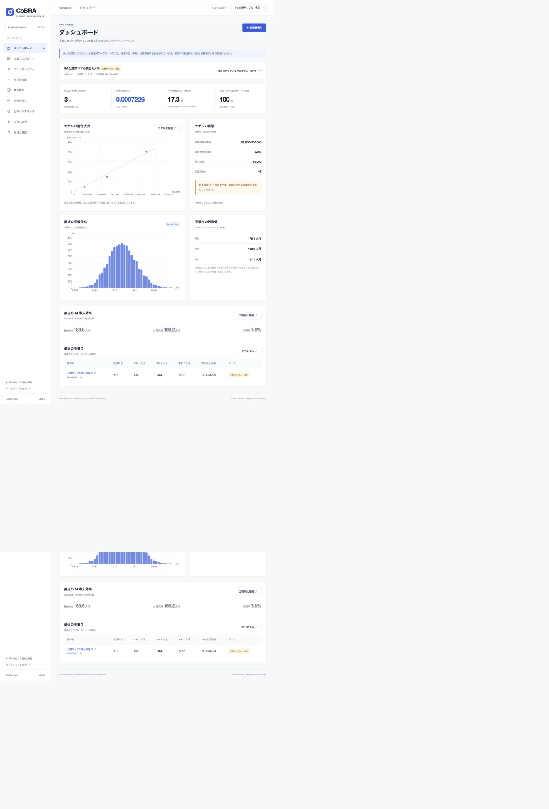

<div align="center">

# CoBRA Web

**見積りの根拠と、不確実性を見える形に。**

CoBRA 法によるソフトウェア開発工数の見積りと、工程別 AI 導入効果分析。

[](https://github.com/kekincai/CoBRA/actions/workflows/ci.yml)
[](pyproject.toml)
[](LICENSE)

[はじめる](#クイックスタート) · [仕様書](docs/requirements-v0.2-ja.md) · [計算検証](docs/algorithm-verification.md) · [データ出所](THIRD_PARTY_NOTICES.md)

</div>



*画面は IPA の公開テストケースを用いた検証結果です。会社の実績ではありません。*

## できること

- **実績を整える** — 案件の規模・工数・固定工数・データ出所・除外理由を記録。CSV を一括検証して取り込み、書き出し。
- **組織モデルをつくる** — Cost Driver の具体的な Level 0–3 定義、複数熟練者の Min / Mode / Max、原点回帰による α 校正。
- **精度を検証する** — Leave-One-Out CV、MMRE、STD、Pred.25、総誤差率、実績 vs. 推定プロット。
- **工数を分布で見積もる** — 1,000–100,000 回の Monte Carlo、ヒストグラム・累積分布、P50 / P80 / P90、全 trial の CSV。
- **日本市場と比較する** — IPA 2022 の SLOC 生産性、FP 生産性、開発期間、工程比率。業種・開発種別・人月換算時間を指定。
- **AI の効果を分けて見る** — 工程ごとの適用率・削減率・追加レビュー・手戻り・固定工数、AI ツール費・インフラ費・導入投資を反映。原価・提示価格・粗利・ROI を比較。
- **後から再現する** — モデル・案件・Driver・熟練者評価をスナップショット保存。見積りの全サンプルと Seed を保持し、同一環境で再計算結果のハッシュを照合。
- **AI 実績を蓄積する** — AI 利用案件の工程工数、レビュー、手戻り、費用、不具合、予測との差分を記録。Scenario の改訂は新しい版として保存。

## クイックスタート

[uv](https://docs.astral.sh/uv/) を用意して実行します。Node.js はアプリの起動には不要です。

```sh
git clone https://github.com/kekincai/CoBRA.git
cd CoBRA
uv sync --locked
uv run uvicorn cobra_web.main:app --host 127.0.0.1 --port 8765
```

ブラウザーで [http://127.0.0.1:8765](http://127.0.0.1:8765) を開きます。

1. **操作を試す**: 右上の「IPA 公開サンプル · 検証」を選択。公開モデルで見積り・AI 比較を実行できます。
2. **実運用に進む**: 「自社データ」に戻し、過去案件を 3 件以上登録します。10 件以上を推奨します。
3. **組織の知識を反映する**: コストドライバーと熟練者評価を見直して、新しい版を保存します。
4. **校正・検証する**: 同じ規模単位・測定方法・開発方式の案件を選び、モデル校正を実行します。
5. **新規案件を見積もる**: 規模と要因を入力して保存。AI 効果は保存した見積りから比較します。

初回は自社データが空の状態で起動します。画面を埋めるための架空実績は投入しません。

## 計算の基本

```text
変動工数 = α × 規模 × (1 + Σ Cost Overhead)
総工数   = 変動工数 + 固定工数
```

Cost Overhead は独立した三角分布を Level / 3 で補正し、校正には総 Overhead の中央値を使用します。
複数熟練者の 3 値はそれぞれ等重みで平均します。CV は固定工数を除く変動工数で評価します。
STD は MRE の母標準偏差です。乱数は PCG64、Driver ID の昇順、分位点は linear 補間を使います。

```text
AI 工程工数 = Baseline 工程工数 − (Baseline × 適用率 × 削減率)
              + 追加 Review + Rework + 固定 AI 工数
```

Review / Rework の分母は既定で `Baseline × AI 適用率`。工程 Baseline 全体へ変更可能です。
元の固定工数は AI 削減の対象外です。AI の削減を負の Cost Driver として校正へ混ぜません。

工数は **人月**、金額は **円**。原価は人件費・管理費・インフラ費・AI 運用費を含みます。
提示価格は `(原価 + 予備費) / (1 − 目標粗利率)`。ROI は `(原価差額 − 追加投資) / 追加投資`。
投資ゼロの ROI は計算不可として表示し、運用費と導入投資を二重計上しません。

## データの境界

| データ | 用途 | 自社モデルの校正 |
|---|---|---|
| `COMPANY_ACTUAL` | 自社実績 | 使用可 |
| `COBRA_PUBLIC_SAMPLE` | 公開例によるアルゴリズム検証 | 使用不可・専用モデルのみ |
| `IPA_BENCHMARK` | 日本市場との比較 | 使用不可 |
| `DEMO` / `SYNTHETIC` | 明示されたデモ・検証用 | 使用不可 |

従来開発と AI 利用開発も、同じ校正モデルへ混在させません。

公開サンプルは **19 Driver / 3 案件**。原資料の規模単位 **「千円」** をそのまま保持しています。
Benchmark は **58 集計レコード**。出典ファイル・シート・セル・ZIP SHA-256 を記録し、原資料に存在しない業種別 FP 値は表示しません。

公開データを取得し直す場合:

```sh
uv run python scripts/prepare_public_data.py
uv run python scripts/verify_algorithm.py
```

取得ファイルは `data/public/` と `data/benchmark/`、会社データは `data/company/` に分離しています。
公開ファイルの加工条件は [Third-party notices](THIRD_PARTY_NOTICES.md) を参照してください。

## 保存と再現性

SQLite の保存先は `data/company/cobra.sqlite3`。環境変数 `COBRA_DB_PATH` で変更できます。
`.env.example` は設定例であり、`.env` の自動読み込みは行いません。

モデル・見積り・Scenario は追記のみで保存します。案件の編集も旧レコードを残します。
サイドバーから JSON バックアップを保存できます。実績情報を含むため、非公開の場所で管理してください。
サーバーを停止した状態で SQLite ファイルをコピーする方法でもバックアップ・復元できます。

`uv.lock` で依存関係を固定します。閲覧時は保存済み結果を表示し、再計算時には保存時の入力・モデルだけを参照します。
数値ライブラリや CPU 環境が異なる場合は浮動小数点の最下位桁が変わる可能性があり、全試行のハッシュ照合で検出します。

## 検証と開発

```sh
uv run pytest -q
uv run ruff check .
uv run ruff format --check .
node --check src/cobra_web/static/app.js
uv build
```

Python 3.12 / 3.13 の計算・API テストに加え、GitHub Actions で Chromium の 4 つの操作シナリオを実行します。
ブラウザーテストは `.tmp/` の専用 DB を使用します。再実行時は古いテスト DB を退避してから開始してください。

```sh
npm ci
npx playwright install chromium
npm run test:e2e
```

- [計算の検証報告](docs/algorithm-verification.md)
- [受入条件・実装範囲](docs/acceptance.md)
- [設計判断](docs/architecture.md)
- [開発への参加](CONTRIBUTING.md)

## 現在の範囲

v0.1 はローカルで利用する MVP です。会社データを使った実運用精度や AI の因果的な効果は、まだ検証していません。
AI Scenario の初期値は仮説で、実績からの自動学習・自動パラメータ更新は未実装です。

元の IPA Excel マクロ自体は実行していないため、旧ツールとの完全互換は未検証です。
公開入力を独立した逆 CDF・最小二乗計算で検証した範囲を [Algorithm verification](docs/algorithm-verification.md) に記載しています。

認証・複数利用者の権限管理はありません。ローカルホストにバインドして使用してください。
インターネットへの直接公開、マルチテナント、LLM による自動見積り、規模の自動算定は対象外です。

## License

アプリケーションコードは [MIT](LICENSE)。IPA のデータと ECharts には、それぞれの利用条件が適用されます。
本プロジェクトは IPA の公式製品ではありません。
